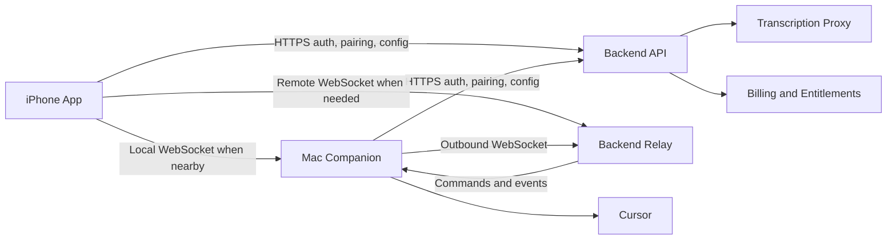
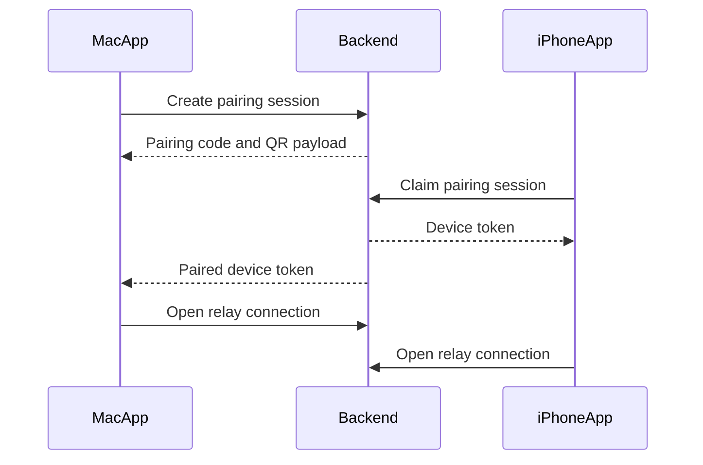
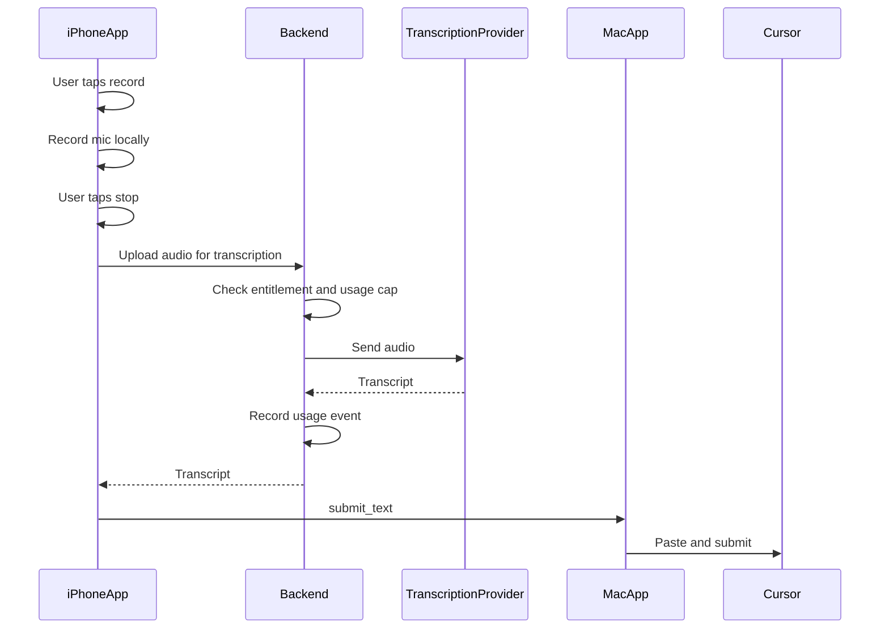

# Blind Monkey Architecture

## Goal

Replace the prototype's phone-hosted web UI and local-only Mac server with a production system that works for normal users without Tailscale:

- Native iPhone app from the App Store.
- Native Mac companion as a signed/notarized direct download.
- Backend relay for remote access, pairing, transcription, accounts, and usage metering.

## High-Level Architecture

## Connection Strategy

Use connection priority:

1. Local network connection.
2. Backend relay connection.
3. Offline/reconnect state.

The iPhone app should hide the transport choice from the user. It shows only:

- `Connected nearby`
- `Connected remotely`
- `Mac offline`

### Local Mode

- Mac companion advertises a local service with Bonjour.
- iPhone app discovers paired Macs on the local network.
- iPhone connects directly to Mac over TLS/WebSocket.
- Local mode uses the same authenticated device session as relay mode.
- Local mode is preferred because it has lower latency and lower backend cost.

### Remote Relay Mode

- Mac companion opens an outbound WebSocket to the backend relay.
- iPhone app opens an outbound WebSocket to the backend relay.
- Relay forwards authenticated commands/events between paired devices.
- No router setup, inbound firewall rule, Tailscale, or VPN is required.

The relay should not need to understand Cursor-specific semantics beyond routing typed messages between trusted paired devices.

## Pairing Model

Pairing QR contents:

- Backend pairing URL.
- One-time pairing code.
- Mac device public key.
- Pairing session expiration.

After pairing:

- Store a device credential on iPhone Keychain.
- Store a device credential on Mac Keychain.
- Backend stores paired device relationship.
- Pairing code expires and cannot be reused.

## Identity And Auth

Recommended v1:

- Sign in with Apple for iPhone.
- Mac companion signs in with same account via web-based auth callback or device code flow.
- Device credentials are separate from user login tokens.

Token classes:

- User access token: short-lived.
- Refresh token: stored securely.
- Device token: scoped to a paired device.
- Relay session token: short-lived, minted by API.

## Message Types

### iPhone To Mac

- `select_window`
- `start_recording_context`
- `cancel_recording_context`
- `submit_text`
- `trackpad_move`
- `trackpad_click`
- `trackpad_right_click`
- `trackpad_scroll`
- `request_window_list`
- `ping`

### Mac To iPhone

- `window_list`
- `cursor_host`
- `focus_result`
- `permission_status`
- `connection_status`
- `command_error`
- `pong`

### iPhone To Backend

- `transcribe_audio`
- `usage_event`
- `create_relay_session`
- `refresh_config`

## Audio And Transcription Flow

Important:

- The iPhone app records audio.
- The Mac does not need to receive raw audio.
- The backend hides the transcription provider API key.
- Audio should be deleted after transcription unless the user opts into diagnostics.

## Mac Companion Responsibilities

- Menu bar app.
- Pairing screen and device management.
- Permission onboarding.
- Cursor window discovery.
- Cursor window focus.
- Text paste and submit.
- Trackpad command execution.
- Local network service.
- Relay connection.
- Update mechanism.
- Crash/error reporting.

## iPhone App Responsibilities

- Sign in and pairing.
- Show paired Mac status.
- Window card UI.
- Recording UI.
- Audio upload to backend.
- Trackpad UI.
- Settings, plan, usage, support.
- Clear permission messaging.

## Backend Responsibilities

- Account/auth.
- Device registry.
- Pairing sessions.
- Relay sessions.
- Transcription proxy.
- Billing entitlements.
- Usage metering.
- Rate limits and abuse controls.
- Admin/support tools.

## Security Requirements

- All traffic over TLS.
- Device credentials in Keychain.
- Pairing tokens expire quickly.
- Relay only connects paired devices.
- Backend authorizes every relay session.
- Commands include monotonically increasing sequence IDs.
- Mac companion rejects commands from unpaired devices.
- User can revoke a paired device from either app.

## Data Retention Defaults

- Do not store raw audio by default.
- Store transcript only long enough to deliver it to the phone.
- Store usage metadata for billing:
  - user ID
  - duration
  - model/provider
  - timestamp
  - request status
  - cost estimate
- Store error logs without transcript/audio unless diagnostics are explicitly enabled.

## Prototype Components To Retire

- `phone/index.html` as the primary customer UI.
- Terminal-based `run.sh` launch flow.
- Manual certificate install flow.
- Tailscale-specific setup as a required path.
- Personal environment variables for launch texting or OpenAI keys.

## Prototype Components To Reuse

- Cursor window discovery approach from `server/cursor_windows.py`.
- Paste and submit approach from `server/clipboard.py` and `server/main.py`.
- Trackpad gesture semantics from `phone/index.html`.
- Tailscale support as an advanced optional transport, not a normal onboarding requirement.
