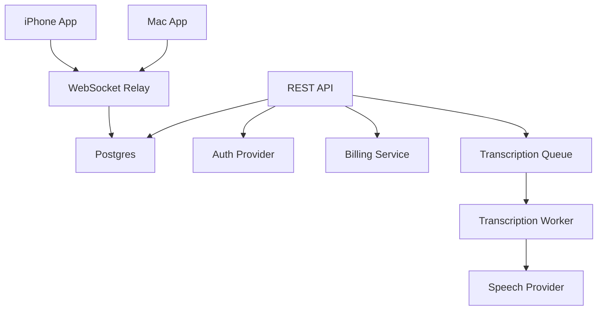

# Blind Monkey Backend MVP

## Backend Goal

The backend makes Blind Monkey usable without Tailscale and without exposing your transcription API key. It handles:

- Accounts.
- Device pairing.
- Remote relay.
- Transcription proxy.
- Usage metering.
- Billing readiness.
- Privacy and abuse controls.

## Recommended Stack

Production-friendly default:

- API: FastAPI or Node/TypeScript.
- Database: Postgres.
- Realtime relay: WebSocket service.
- Queue: Redis or managed queue for transcription jobs.
- Object storage: only if temporary audio buffering is needed.
- Billing: Stripe for web billing, with Apple IAP reviewed separately for iOS digital unlocks.
- Hosting: Fly.io, Render, Railway, AWS, or GCP. Choose a provider with persistent WebSocket support.

For fastest iteration from the current repo, FastAPI is reasonable because the prototype already uses Python and FastAPI.

## Core Services



## Data Model

### users

- `id`
- `apple_sub`
- `email`
- `created_at`
- `deleted_at`

### devices

- `id`
- `user_id`
- `type`: `iphone` or `mac`
- `display_name`
- `public_key`
- `created_at`
- `last_seen_at`
- `revoked_at`

### pairings

- `id`
- `user_id`
- `mac_device_id`
- `iphone_device_id`
- `created_at`
- `revoked_at`

### pairing_sessions

- `id`
- `user_id`
- `mac_device_id`
- `code_hash`
- `expires_at`
- `claimed_at`

### relay_sessions

- `id`
- `device_id`
- `pairing_id`
- `session_token_hash`
- `created_at`
- `expires_at`
- `closed_at`

### usage_events

- `id`
- `user_id`
- `device_id`
- `type`: `transcription`
- `audio_seconds`
- `model`
- `provider`
- `estimated_cost_cents`
- `status`
- `created_at`

### subscriptions

- `id`
- `user_id`
- `provider`
- `provider_customer_id`
- `provider_subscription_id`
- `plan`
- `status`
- `current_period_end`

## API Endpoints

### Auth

- `POST /auth/apple`
- `POST /auth/refresh`
- `POST /auth/logout`
- `DELETE /account`

### Devices

- `POST /devices`
- `GET /devices`
- `PATCH /devices/{device_id}`
- `DELETE /devices/{device_id}`

### Pairing

- `POST /pairing-sessions`
- `GET /pairing-sessions/{id}`
- `POST /pairing-sessions/{id}/claim`
- `DELETE /pairings/{id}`

### Relay

- `POST /relay/sessions`
- `GET /relay/ws`

### Transcription

- `POST /transcriptions`
- `GET /usage`

### Billing

- `GET /billing/entitlement`
- `POST /billing/checkout`
- `POST /billing/webhook`
- `GET /billing/portal`

## Relay Design

The relay should be message-agnostic:

- Authenticate each WebSocket connection.
- Confirm the device belongs to a valid pairing.
- Route messages from iPhone to Mac and Mac to iPhone.
- Apply per-session rate limits.
- Drop oversized or invalid messages.
- Track online/offline state.

Relay message envelope:

```json
{
  "id": "uuid",
  "pairing_id": "uuid",
  "from_device_id": "uuid",
  "to_device_id": "uuid",
  "type": "submit_text",
  "seq": 42,
  "payload": {}
}
```

## Transcription Proxy

The transcription endpoint should:

1. Authenticate user.
2. Check subscription entitlement.
3. Check daily/monthly usage cap.
4. Validate audio size and duration.
5. Send audio to provider.
6. Return transcript.
7. Record usage event.
8. Delete raw audio immediately unless diagnostics are enabled.

Hard limits for v1:

- Max recording length: 120 seconds.
- Max file size: 25 MB.
- Max requests per minute per user.
- Monthly included minutes by plan.
- Emergency account-level spend cap.

## Billing Readiness

Billing can launch after beta, but the backend must meter from day one.

Recommended initial plans:

- Free beta: limited minutes/month.
- Pro: subscription with included transcription minutes.
- Overage: disabled at first; ask users to upgrade rather than surprise-bill.

Apple IAP note:

- If the iOS app unlocks paid digital functionality, Apple may require in-app purchase.
- If billing is for a cross-platform service used on Mac and web too, Stripe may still be usable in some flows, but this needs legal/App Review review before launch.

## Privacy Defaults

- No raw audio retention by default.
- No transcript retention by default beyond request delivery.
- Store metadata required for billing and debugging.
- Allow account deletion.
- Allow paired device revocation.
- Clearly disclose transcription provider.

## Abuse Controls

- Rate limit transcription requests.
- Rate limit relay messages.
- Require paired devices for relay.
- Block anonymous transcription.
- Detect repeated failed pairing attempts.
- Enforce max paired Macs per account by plan.
- Add admin kill switch for runaway usage.

## Admin Tools

Minimum admin dashboard:

- User lookup.
- Devices and pairings.
- Current subscription.
- Usage summary.
- Recent errors.
- Ability to revoke device/session.
- Ability to disable account.

## MVP Milestones

### Backend Milestone 1: Auth And Devices

- Apple Sign In token verification.
- User table.
- Device registration.
- Device revoke.

### Backend Milestone 2: Pairing

- Create pairing session from Mac.
- Claim pairing session from iPhone.
- Store pairing.
- Pairing QR payload.

### Backend Milestone 3: Relay

- WebSocket auth.
- Paired device routing.
- Online/offline state.
- Message size and rate limits.

### Backend Milestone 4: Transcription

- Upload audio.
- Call transcription provider.
- Return transcript.
- Meter usage.
- Enforce limits.

### Backend Milestone 5: Billing Readiness

- Entitlement endpoint.
- Usage page data.
- Stripe customer/subscription records.
- Webhook handling.
- Admin usage caps.

## Definition Of Done

- A paired iPhone can send commands to a paired Mac over the relay with no local network.
- Audio can be transcribed without exposing provider credentials to either app.
- Usage is metered per user.
- A user can revoke a paired device.
- Raw audio is not retained by default.
- Backend can enforce a hard spend cap before public beta.
